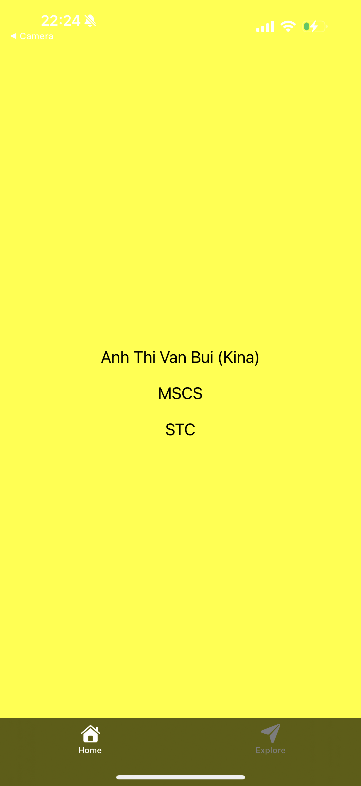

# 📱 PE01 - HelloWorld App

## Input

The program does not take any dynamic user input at runtime. Instead, the inputs are **hardcoded values** embedded in the React Native components within the `App.js` file. These include:

- My full name: **Anh Thi Van Bui**
- My degree program: **MSCS**
- My school name: **STC**

These three text values are defined as strings and passed into `<Text>` components to be displayed on the screen. There is no user interaction required to provide input.

---

## Process

The processing of this application is handled entirely by React Native and Expo. Here's how the program works behind the scenes:

1. **React Native Component Rendering:**
   - The root component is a function component named `App`.
   - It returns a single `<View>` component that contains three `<Text>` components.
   - A `StyleSheet` is defined to style both the container and text.

2. **Expo Environment:**
   - The app is created using Expo (`npx create-expo-app`) and run using `npx expo start --tunnel`.
   - Expo handles the bundling of JavaScript, launching of Metro Bundler, and serving the app for preview in Expo Go.

3. **Styling and Layout:**
   - The `<View>` component is styled with:
     - `flex: 1` to fill the screen
     - `backgroundColor: 'yellow'` to meet the user requirement
     - Center alignment using `alignItems` and `justifyContent`.
   - Each `<Text>` component is styled for readability and spacing.

4. **Code Constraints:**
   - The app uses exactly **five React Native components** as required:
     - 1 View
     - 3 Text
     - 1 StyleSheet

---

## Output

The final output is a visually centered mobile interface that displays the following three lines of text:

- These are displayed on a **yellow background**.
- The app renders identically on both Android and iOS (via Expo Go).
- There are no interactive elements—just a static presentation of text.

This output successfully fulfills both the **user requirements** (yellow background and message content) and **system constraints** (exact number of components) for PE01.

