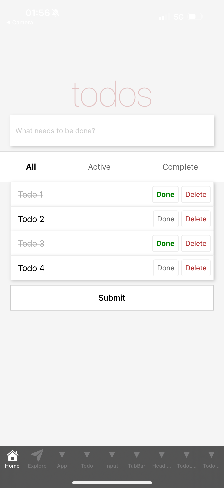
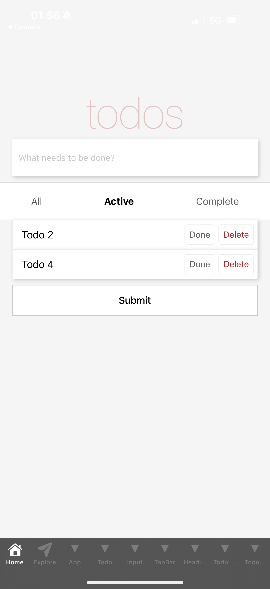
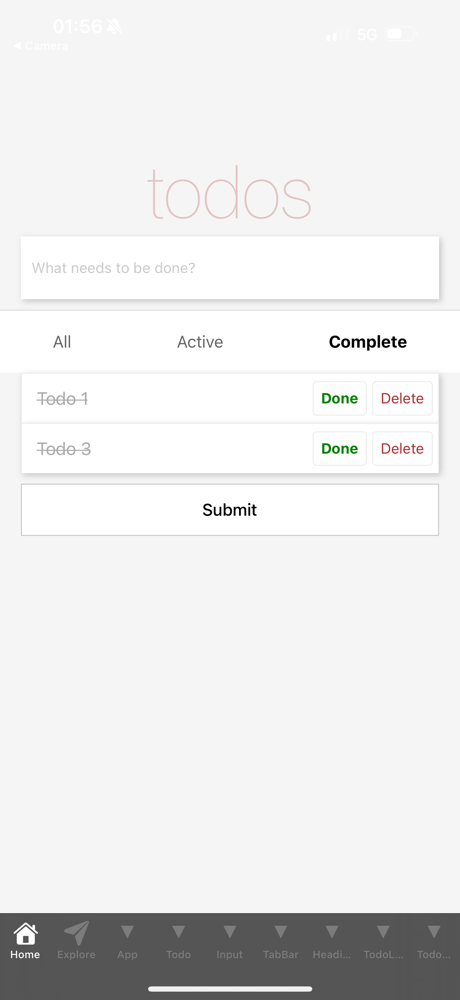

# PE03 – Todos App

This project is a React Native to-do list application built using Expo. It demonstrates key concepts such as state management with `setState`, list rendering, component composition, user interaction handling, and conditional filtering. The app allows users to add tasks, mark them as complete, delete them, and filter the list using a tab bar with three options: **All**, **Active**, and **Complete**.

---

# Input

The user interacts with the app by:
- Entering a to-do item in a `TextInput` field.
- Pressing the **Submit** button to add the task to the list.
- Pressing the **Done** button to mark the task as completed.
- Pressing the **Delete** button to remove a task.
- Tapping one of the three tabs (**All**, **Active**, **Complete**) at the bottom to filter which tasks are displayed.

The `todoIndex` is auto-incremented for each new item, and all actions are logged to the terminal.

---

# Process

The app is implemented using class-based components with internal state managed via `this.state`. It was developed in two stages:

- **Part 1**: Copied from HOS03. Added logic to append a new task to the `todos` array when the Submit button is clicked. Tasks are stored with `title`, `todoIndex`, and `complete` status.

- **Part 2**: Continued from HOS04. Integrated a custom `TabBar` component that filters the list. The `TodoList` component filters `todos` based on the selected tab before rendering. Styling ensures the tab bar stays fixed at the bottom of the screen.

The app uses components such as `View`, `Text`, `ScrollView`, and `TouchableHighlight`, with styling handled by `StyleSheet.create()`.

---

# Output

The app displays:
- A header titled **todos**
- A text input with a submit button
- A scrollable to-do list with each item including:
  - The task title (with strikethrough if completed)
  - A **Done** button (green when completed)
  - A **Delete** button
- A tab bar at the bottom with **All**, **Active**, and **Complete** tabs that filter the visible items
- Terminal logs of every submitted task

Screenshots of the app UI and console logs were captured on a mobile device and saved in the PE03 folder.

---

## 🚀 How to Run the Program

To run this project inside GitHub Codespaces using Expo:

1. **Open Terminal in Codespaces**

cd todos

2. **Start the app**

npx expo start --tunnel

3. **View the App**
- On your phone:
  - Download the **Expo Go** app (iOS/Android)
  - Scan the QR code displayed in your terminal
- On your browser:
  - Press `w` in the terminal to open the app in a web browser

---

✅ *Developed as part of CS624 - Mobile Full Stack Development course assignment (PE03).*
